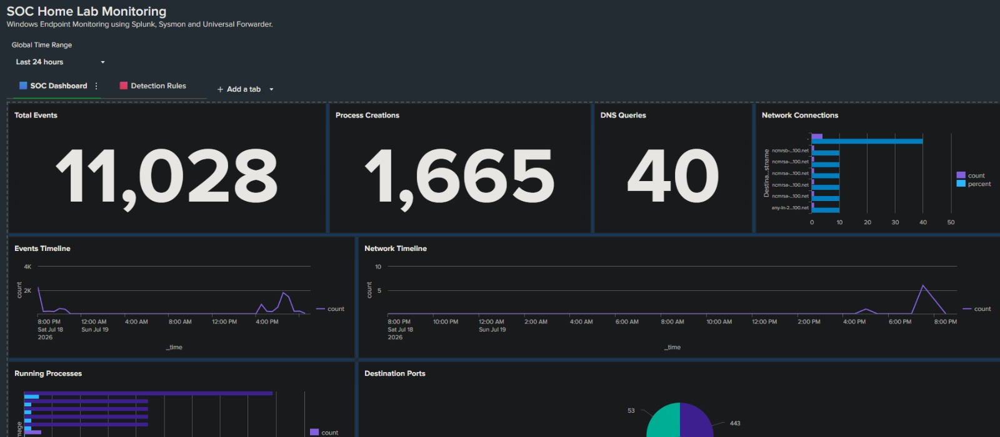
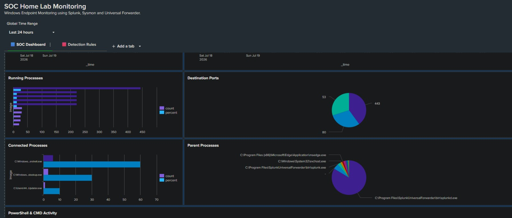
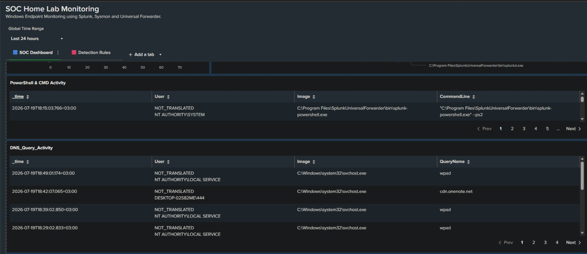
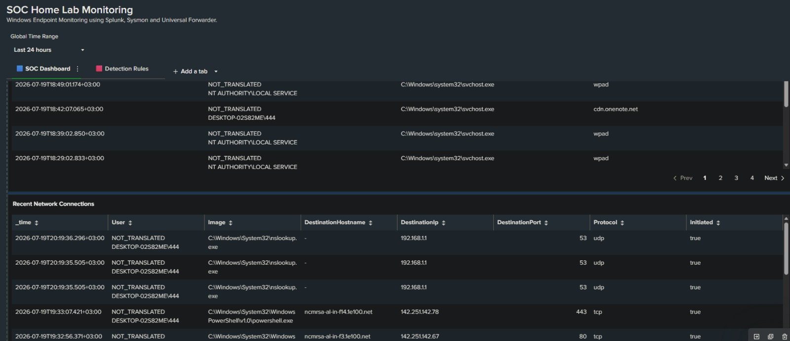
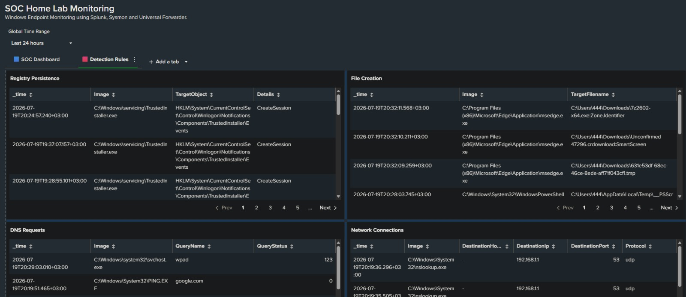
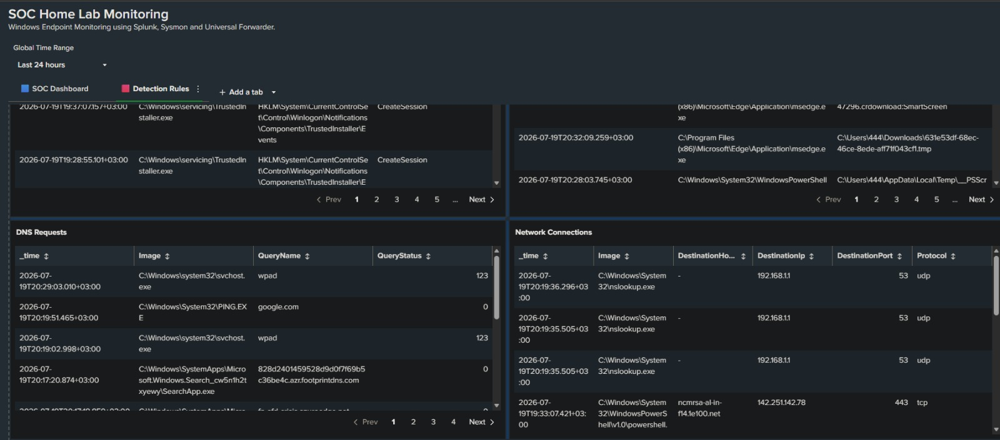

# 🛡️ SOC Home Lab using Splunk Enterprise

A hands-on Security Operations Center (SOC) Home Lab built using **Splunk Enterprise**, **Sysmon**, and **Splunk Universal Forwarder** for Windows endpoint monitoring, log analysis, and threat detection.

---

# 📌 Project Summary

This project simulates a real-world Security Operations Center (SOC) environment by collecting Windows endpoint telemetry and analyzing security events using Splunk Enterprise.

The primary objective was to strengthen practical skills in:

- Security Monitoring
- Windows Event Analysis
- Threat Detection
- Dashboard Development
- Detection Engineering
- SPL Query Development

---

# 🏗️ Lab Environment

| Component | Purpose |
|-----------|---------|
| Windows 11 Virtual Machine | Endpoint Monitoring |
| Kali Linux | Attack Simulation & Testing |
| Sysmon | Windows Endpoint Telemetry |
| Splunk Universal Forwarder | Log Collection & Forwarding |
| Splunk Enterprise | SIEM Platform |

---

# 🔍 Monitoring Dashboard

The Monitoring Dashboard provides real-time visibility into Windows endpoint activity.

### Features

- Total Events
- Process Creation
- DNS Queries
- Network Connections
- Event Timeline
- Running Processes
- Parent Processes
- PowerShell Activity
- Recent Network Connections

## Dashboard Screenshots

---

# 🚨 Detection Dashboard

Custom SPL detection rules were developed to identify suspicious endpoint activity.

### Detection Rules

- PowerShell Execution
- Command Prompt Execution
- Encoded PowerShell Detection
- Registry Persistence
- File Creation Monitoring
- DNS Requests
- Network Connections
- Executable Downloads

## Dashboard Screenshots

---

# 🛠️ Skills Demonstrated

- Splunk Enterprise
- Search Processing Language (SPL)
- Sysmon Configuration
- Windows Event Analysis
- SIEM Monitoring
- Threat Detection
- Dashboard Development
- Log Collection & Normalization
- Blue Team Fundamentals

---

# 🚀 Future Improvements

- Windows Server Integration
- Active Directory Deployment
- MITRE ATT&CK Mapping
- Splunk Alerting
- Threat Hunting Dashboard
- Incident Response Playbooks

---

# 👨‍💻 Author

**Firas Saud**

Information Technology Student

Interested in Cybersecurity, SOC Operations, and Blue Teaming.
